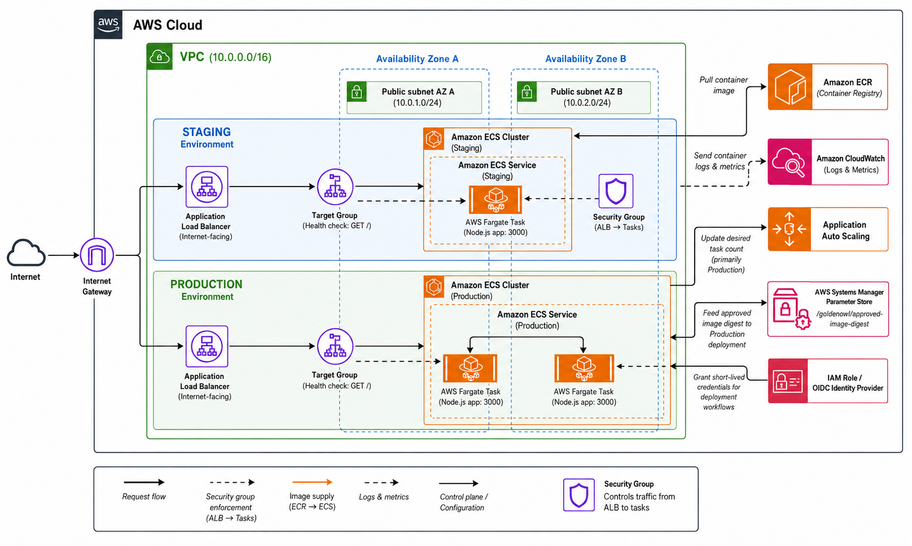
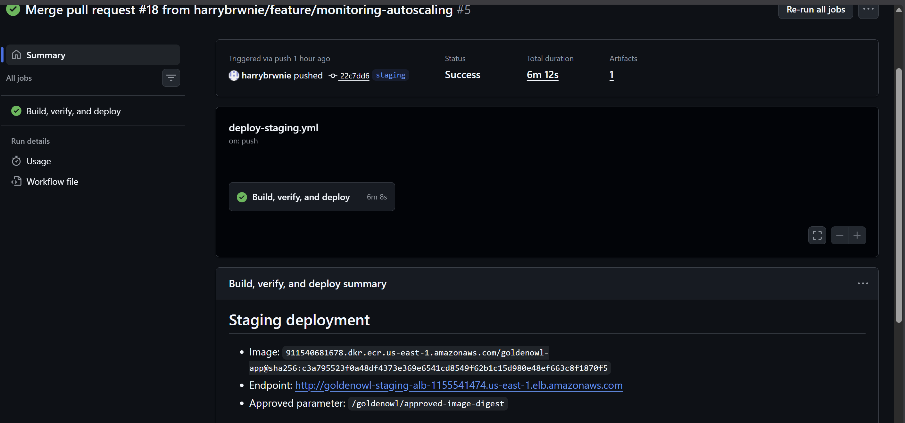
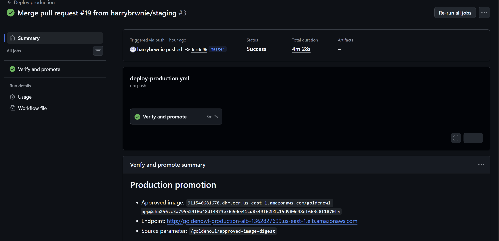
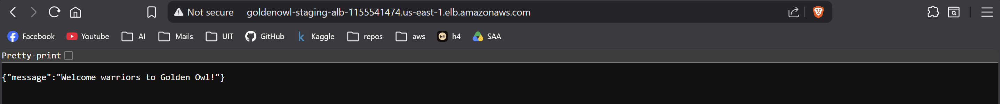
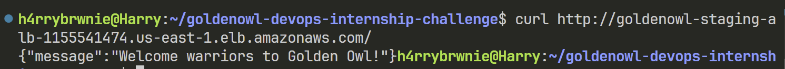
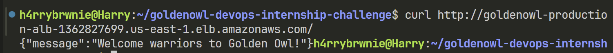
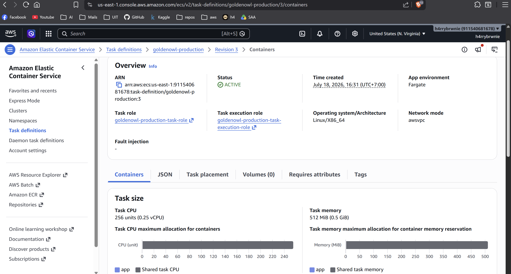
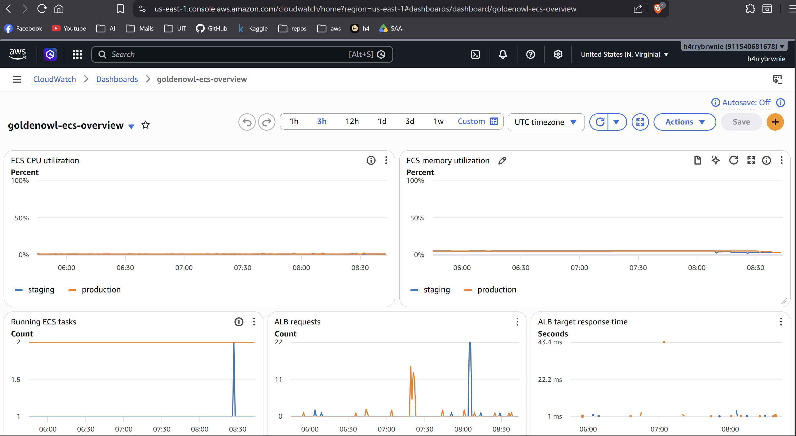
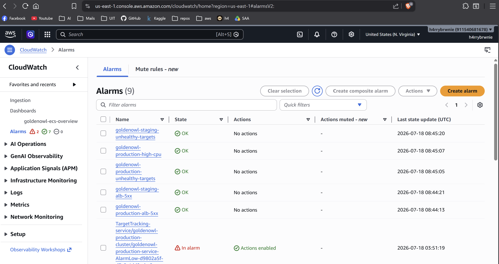

# Golden Owl DevOps Internship Challenge

## 1. Solution Overview

This project delivers a hardened Node.js application through GitHub Actions to
AWS ECS Fargate. Terraform provisions the infrastructure, staging builds and
approves one immutable image, and production promotes the exact same digest.
CloudWatch provides logs, metrics, dashboards, and alarms.

Fargate was selected over EC2 and EKS because this is a small stateless service:
it provides health checks, rolling deployments, and scaling without managing
hosts or adding unnecessary Kubernetes overhead.

## 2. What Was Implemented

| Area           | Implementation                                                          |
| -------------- | ----------------------------------------------------------------------- |
| Container      | Multi-stage, pinned, distroless, non-root image                         |
| CI             | Formatting, linting, tests, audit, Hadolint, Docker build, and Trivy    |
| Supply chain   | Immutable SHA tags, digest deployment, SPDX SBOM, and Cosign            |
| AWS access     | GitHub OIDC with separate least-privilege deployment roles              |
| Infrastructure | Terraform-managed VPC, ECR, SSM, IAM, ALB, ECS, and CloudWatch          |
| Environments   | Independent staging and production ECS services and ALBs                |
| Reliability    | Auto Scaling, health checks, smoke tests, circuit breaker, and rollback |
| Observability  | CloudWatch Logs, Container Insights, dashboard, and alarms              |

### Repository Structure

```text
.
├── .github/workflows/
│   ├── ci.yml
│   ├── deploy-staging.yml
│   └── deploy-production.yml
├── docs/                       # Architecture and deployment evidence
├── infra/
│   ├── bootstrap/              # Encrypted, versioned S3 state backend
│   ├── live/
│   │   ├── shared/             # VPC, ECR, SSM, and deployment IAM
│   │   ├── staging/            # Staging ALB and ECS service
│   │   ├── production/         # Production ALB and ECS service
│   │   └── monitoring/         # CloudWatch dashboard and alarms
│   └── modules/
│       ├── network/
│       ├── ecr/
│       ├── ecs-environment/
│       └── github-deployment-iam/
├── scripts/smoke-test.sh
├── src/                        # App, tests, and hardened Dockerfile
└── README.md
```

## 3. Architecture



_Simplified runtime architecture. Security-group lines represent the ALB-to-task
restriction; SSM and OIDC/IAM are deployment control-plane components rather
than part of the application request path._

Both environments use a shared VPC, ECR repository, SSM parameter, and GitHub
OIDC provider. Each environment has a dedicated ALB, ECS cluster, and service
for clear isolation, at the cost of an additional ALB.

Fargate tasks use public subnets and public IPs to avoid NAT Gateway cost, while
their security groups accept port `3000` only from the matching ALB security
group.

## 4. Evidence

The following evidence was captured while the infrastructure was running. The
AWS resources were subsequently destroyed to avoid ongoing charges, so the ALB
URLs shown below are no longer active.

### Automated deployments

The staging workflow successfully built, verified, and deployed the image, then
stored its immutable digest in SSM Parameter Store:



The production workflow successfully verified and promoted the staging-approved
image without rebuilding it. The workflow summaries show the same ECR digest in
both environments:



### Application endpoints

The staging ALB returned the expected JSON response in a browser:



Both environments also passed direct command-line smoke checks:

**Staging**



**Production**



### ECS Fargate

The active production task definition used Fargate with `awsvpc` networking,
`0.25 vCPU`, and `512 MiB` of memory:



### Monitoring

The shared CloudWatch dashboard displayed staging and production ECS CPU,
memory, running-task, ALB request, and response-time metrics:



CloudWatch alarms covered unhealthy ALB targets, ALB 5XX responses, production
CPU, and the Auto Scaling policies created for the ECS services:



## 5. CI/CD

```text
Feature push
  -> npm quality checks and audit
  -> Hadolint and secret scan
  -> Docker build
  -> Trivy image scan
  -> coverage and SPDX SBOM artifacts

Feature PR -> staging merge
  -> repeat quality and security checks
  -> authenticate to AWS with OIDC
  -> build the image once
  -> push immutable Git-SHA tag to ECR
  -> resolve immutable image digest
  -> Cosign keyless sign and verify
  -> deploy digest to staging ECS
  -> wait for service stability
  -> smoke test staging endpoint
  -> save approved digest in SSM

Staging PR -> master merge
  -> wait for production Environment approval
  -> authenticate to AWS with OIDC
  -> read staging-approved digest from SSM
  -> verify the image exists in ECR
  -> verify the staging Cosign signature
  -> deploy the same digest to production ECS
  -> wait for service stability
  -> smoke test production endpoint
```

Tags provide commit traceability; digest references guarantee that staging and
production execute identical image content. Both deployments wait for ECS
service stability and validate the HTTP status and expected JSON response.
Failed ECS revisions are handled by the deployment circuit breaker and automatic
rollback.

## 6. Workflows

| Workflow                                                           | Trigger                                        | AWS access           | Responsibility                                                  |
| ------------------------------------------------------------------ | ---------------------------------------------- | -------------------- | --------------------------------------------------------------- |
| [`ci.yml`](.github/workflows/ci.yml)                               | Push `feature/**`; PR to `staging` or `master` | None                 | Quality gates, image validation, coverage, and SBOM artifacts   |
| [`deploy-staging.yml`](.github/workflows/deploy-staging.yml)       | Push `staging`; manual                         | Staging OIDC role    | Build, scan, push, sign, deploy, smoke test, and approve digest |
| [`deploy-production.yml`](.github/workflows/deploy-production.yml) | Push `master`; manual                          | Production OIDC role | Verify and promote the approved digest without rebuilding       |

Documentation-only changes under `docs/**` or `README.md` do not trigger AWS
deployments; both deployment workflows remain available through manual dispatch.

## 7. Environments

| Configuration | Staging | Production |
| ------------- | ------- | ---------- |
| Desired tasks | 1       | 2          |
| Minimum tasks | 1       | 2          |
| Maximum tasks | 2       | 4          |
| CPU target    | 65%     | 60%        |
| Log retention | 7 days  | 30 days    |

GitHub Environment variables:

| Environment  | Variables                        | Protection                                           |
| ------------ | -------------------------------- | ---------------------------------------------------- |
| `staging`    | `AWS_ROLE_ARN`, `STAGING_URL`    | Deployment restricted to `staging`                   |
| `production` | `AWS_ROLE_ARN`, `PRODUCTION_URL` | Required reviewer; deployment restricted to `master` |

ALB DNS names can change after recreation, so `STAGING_URL` and
`PRODUCTION_URL` must be refreshed after each new provision.

## 8. Security

Security controls are applied throughout the delivery lifecycle rather than
only after deployment:

- **Source:** Prettier, ESLint, Jest, npm audit, and Trivy secret scanning fail
  unsafe changes early.
- **Build:** Hadolint, pinned base-image digests, production-only dependencies,
  and HIGH/CRITICAL vulnerability scans harden the artifact.
- **Supply chain:** immutable SHA tags, digest-based deployments, SPDX SBOM, and
  keyless Cosign signing provide traceability and provenance.
- **Identity:** GitHub OIDC issues temporary AWS credentials to separate,
  least-privilege staging and production roles.
- **Runtime:** the distroless container runs non-root with a read-only root
  filesystem, dropped Linux capabilities, an init process, and health checks.
- **Network:** tasks accept application traffic only from their ALB security
  group; port `3000` is never exposed directly to the Internet.
- **Deployment:** production approval, signature verification, smoke tests, and
  automatic rollback prevent unverified releases from progressing.

## 9. Monitoring and Reliability

Each ECS environment sends application output to a dedicated CloudWatch Log
Group. Container Insights and the shared dashboard cover:

- ECS CPU and memory utilization.
- Running task count.
- ALB request count and target response time.
- ALB 5XX responses.
- Healthy and unhealthy target counts.

## 10. Operations

### Local verification

```bash
cd src
npm ci
npm run format:check
npm run lint:check
npm test
npm audit --omit=dev --audit-level=high
docker build -t goldenowl-app:local .
docker run --rm -p 3000:3000 goldenowl-app:local
curl --fail http://localhost:3000/
```

Expected response:

```json
{ "message": "Welcome warriors to Golden Owl!" }
```

### Provisioning

Provision in dependency order:

1. Apply `infra/bootstrap` to create the remote-state bucket.
2. Initialize and apply `infra/live/shared`.
3. Build and push a bootstrap image to the new ECR repository, resolve its
   digest, and set `container_image` in staging and production `terraform.tfvars`.
4. Apply `infra/live/staging`, then `infra/live/production`.
5. Apply `infra/live/monitoring` after both ALBs exist.
6. Update the two GitHub Environment URLs and verify the role ARNs.

Smoke test an active endpoint with:

```bash
./scripts/smoke-test.sh "$(terraform -chdir=infra/live/staging output -raw alb_url)"
```
